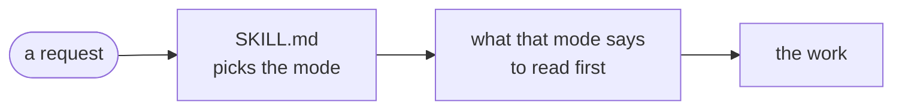

# ha-skills

An installable [Claude Code](https://claude.com/claude-code) plugin for building **Home
Assistant custom integrations**, and the scaffold that wires them to their CI.

> [!NOTE]
> **AI assistance:** I'm a programmer; these skills and my HA integrations are built with
> AI (Claude, via Claude Code) for implementation, code review, and QA, under human
> direction. Architecture and final review are mine; every change is human-reviewed before
> it merges.

These are the skills behind the AI-assistance note on my HA integrations, such as
[ocado-ha](https://github.com/PineappleEmperor/ocado-ha) and
[ha-pimoroni-unicorn](https://github.com/PineappleEmperor/ha-pimoroni-unicorn).

## Skills

| Skill | What it does |
|-------|--------------|
| [`ha-integration`](plugins/ha/skills/ha-integration/SKILL.md) | Scaffold, modify, audit, and lint a HA custom integration targeting **Platinum** quality scale. Config flows, the `DataUpdateCoordinator` pattern, entity and notify platforms, diagnostics, `quality_scale.yaml` discipline, and panel integrations. |
| [`ha-panel-design`](plugins/ha/skills/ha-panel-design/SKILL.md) | Size, type, spacing, and colour for HA **custom panels** (Lit/TS web components). Material 3 type scale, 48px touch targets, and HA theme CSS custom properties, preferring tokens over hardcoded literals. |
| [`ha-triage`](plugins/ha/skills/ha-triage/SKILL.md) | Work out what is actually wrong in a HA instance — from a `home-assistant.log`, a Settings → System → Logs download, or a symptom with no log at hand. Turns thousands of lines into a short list ranked by root cause, separating real faults from HA's background noise. |

All three ship in one **`ha`** plugin, and each looks up the current HA or Material 3 docs
before acting, because these APIs move and memory goes stale.

## How `ha-integration` works



Three rules hold across the modes:

- A rule about Home Assistant is read from its developer docs or from core, not from memory.
- CI files and configs are copied from `templates/` or from the CI repositories, never authored.
- Versions, pins and revisions taken from outside sit in one ledger, `reference/freshness.md`.

## Install

Add this repo as a marketplace and install the plugin from inside Claude Code:

```
/plugin marketplace add PineappleEmperor/ha-skills
/plugin install ha@ha-skills
```

Update later with `/plugin marketplace update ha-skills`.

## Development

This repository's CI is [`.github/workflows/ci.yml`](.github/workflows/ci.yml): ruff, the
tests under `tests/`, the two audits in `scripts/`, and a check that fails once PyPI serves a
newer Home Assistant minor than the release row of the skill's `reference/freshness.md` names.

## License

[Creative Commons Attribution-NonCommercial 4.0 International](LICENSE) (CC BY-NC 4.0):
share and adapt with credit, **non-commercial use only**.
