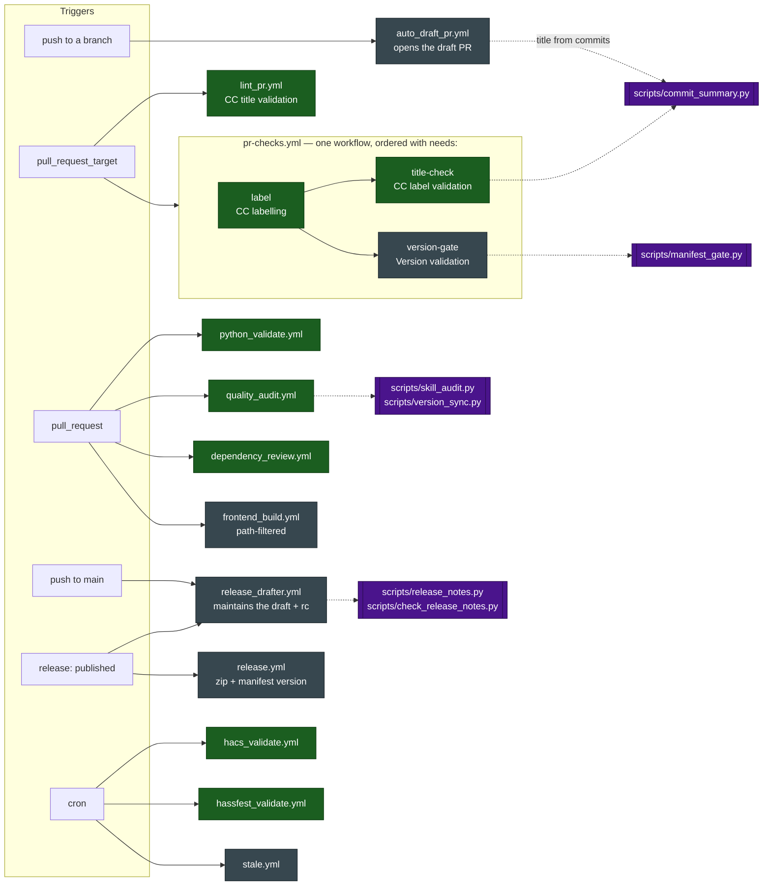
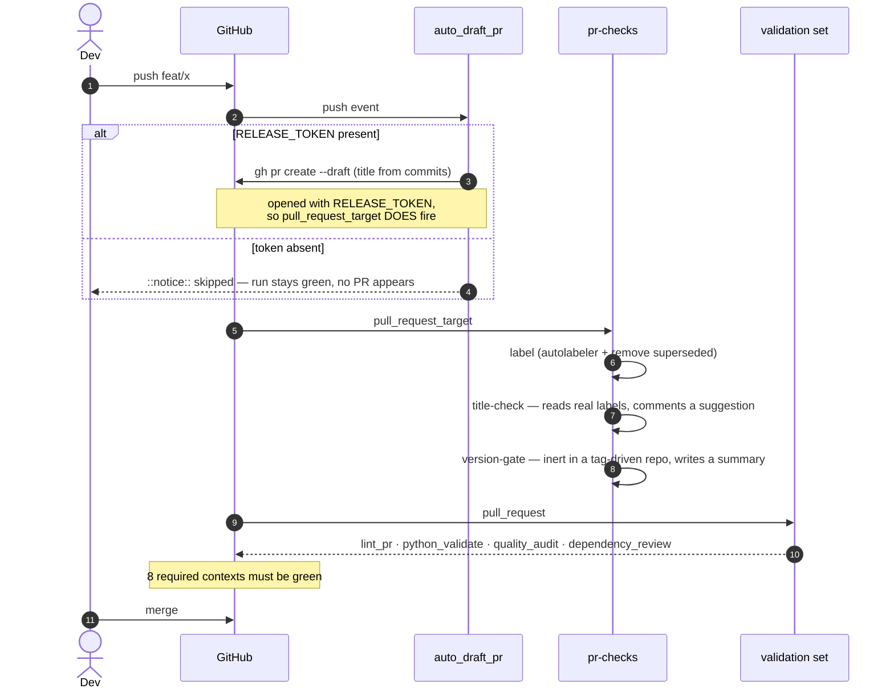
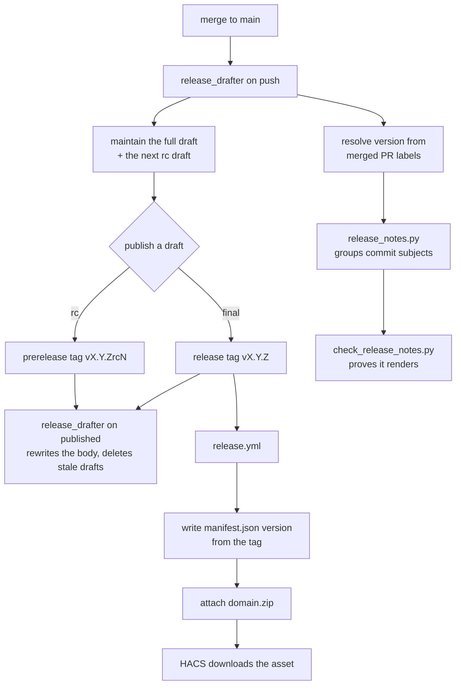

# The shipped workflow set — evidence for review

Repo-local. Describes `plugins/ha/skills/ha-integration/templates/.github/`, which is what a
scaffolded integration inherits. Built by reading all twelve workflow files, not from the
prose that describes them — several claims in that prose turned out to be wrong.

**This is evidence, not a verdict.** The review it supports asks two questions of every
workflow, and both have to be answered before anything is kept: *does the set as a whole
achieve what we intend*, and *is this workflow individually correct and worth shipping*.

---

## What the set is trying to do

Read off the workflows themselves, four jobs of work:

1. **Decide the version without anyone typing it** — labels on merged PRs resolve a semver
   bump; the release tag writes it into `manifest.json` at publish.
2. **Make the release notes from commit subjects**, not PR bodies, and prove they render.
3. **Refuse a merge that breaks the integration** — lint, types, tests, HACS, hassfest, and
   conformance to this skill.
4. **Remove typing from the loop** — the PR title comes from the commits, the draft PR opens
   itself, the release draft maintains itself.

Everything below should be judged against those four. A workflow that serves none of them is
a candidate for removal regardless of whether it works.

---

## Evidence table

`Context` is the check-run name GitHub sees — the string a ruleset must match.
`Required` means the name appears in `templates/ruleset.json`.

| Workflow | Trigger | Context (job name) | Required | Permissions | Depends on | On failure |
|---|---|---|---|---|---|---|
| `pr-checks.yml` · `label` | `pull_request_target` (opened, reopened, synchronize, edited) | `CC labelling` | ✅ | `contents: read`, `pull-requests: write` | autolabeler action, `gh` | PR unlabelled → no release category |
| `pr-checks.yml` · `title-check` | same, `needs: label` | `CC label validation` | ✅ | inherited | `scripts/commit_summary.py` | **cannot fail** — warns and exits 0 |
| `pr-checks.yml` · `version-gate` | same, `needs: label` | `Version validation` | ❌ deliberate | inherited | `scripts/manifest_gate.py` | skips all comparisons in a tag-driven repo |
| `lint_pr.yml` | `pull_request_target` | `CC title validation` | ✅ | `pull-requests: read` | `amannn/action-semantic-pull-request` | red until the title uses one of ten types |
| `python_validate.yml` | `push: main`, `pull_request` | `Ruff, Pyright and Pytest` | ✅ | `contents: read` | `requirements.test.txt` | red on lint, type or test failure; **warns only** when `tests/` is absent |
| `quality_audit.yml` | `push: main`, `pull_request` | `ha-integration conformance check` | ✅ | `contents: read` | `skill_audit.py`, `version_sync.py` | red on any audit FAIL |
| `hacs_validate.yml` | `push: main`, `pull_request`, daily cron | `HACS validation` | ✅ | `contents: read` | `hacs/action@main` (mutable) | red on any of nine HACS checks |
| `hassfest_validate.yml` | `push: main`, `pull_request`, daily cron | `Hassfest manifest validation` | ✅ | `contents: read` | `home-assistant/actions/hassfest@master` (mutable) | red on manifest/quality-scale violation |
| `dependency_review.yml` | `pull_request` | `Dependency review` | ✅ | `contents: read` | dependency graph **enabled** | red at `high` severity; **permanently red if the graph is off** |
| `frontend_build.yml` | push/PR, **path-filtered** | `Panel bundle staleness check` | ❌ can't be | `contents: read` | `frontend/`, npm | red when the committed bundle ≠ a fresh build |
| `auto_draft_pr.yml` | `push` to any branch but `main` | `Auto draft PR` | ❌ not a check | `contents: read` | `RELEASE_TOKEN`, `commit_summary.py` | **silent no-op** — `::notice::` and exit 0 |
| `release_drafter.yml` | `push: main`, `release: published` | `Auto draft releases` | ❌ not a check | `contents: write`, `pull-requests: write` | `release_notes.py`, `check_release_notes.py` | red on the release path only |
| `release.yml` | `release: published` | `Auto release zip` | ❌ not a check | `contents: write` | none | red → HACS install fails with `Could not download` |
| `stale.yml` | weekly cron, `workflow_dispatch` | `Mark stale` | ❌ not a check | `issues: write`, `pull-requests: write` | none | labels only; never closes |

---

## How they relate

Green is a required context; grey is not; purple is a shipped script the workflow cannot run
without. **Three workflows depend on `scripts/`** — that is why `scripts/` is not optional in
a scaffold, and why a stale copy of one script breaks CI in a way the workflow file alone
does not explain.

---

## The PR path, end to end

## The release path

The tag is the only place a version is written by hand, and it is written once, by a human
publishing a draft.

---

## What the set-level review has to resolve

These are the couplings and gaps a per-workflow read cannot settle. Each is verified against
the files above.

1. **A required check that cannot go red.** `CC label validation` is required by the ruleset,
   but `title-check` emits `::warning::` and exits 0 in every path. It buys a comment on the
   PR and nothing enforceable. Either it should fail when no label resolves, or it should come
   out of the required list — keeping both is the "decorative gate" the skill warns about.
2. **Two mutable action refs are required contexts.** `hacs/action@main` and
   `hassfest@master` are deliberately unpinned so they track upstream rules. That is defensible,
   but it means an upstream change can turn a required check red with no commit in this repo.
   The daily cron exists to find that out before a PR does — worth confirming that is the
   intent, because nothing says so.
3. **`dependency_review` is required and fails closed on a repo setting.** With the dependency
   graph off it does not skip; it fails. Every scaffolded repo therefore has a required check
   that is red until someone toggles a GitHub setting `bootstrap_repo.sh` handles. Intentional
   or not, it is the single most likely first-run failure.
4. **`auto_draft_pr` fails silently.** No token means no PR and a green run. Nothing in CI
   goes red; only `skill_audit.py` notices, and only when it can list secrets.
5. **`release_drafter.yml` carries most of the set's complexity in one unrequired job** —
   version resolution, two draft releases, rc numbering, notes generation, GitHub's
   New Contributors block, stale-draft cleanup, and render validation. It is the least
   observable workflow (it only runs on `main` and on publish) and the most consequential.
   Worth asking whether the rc-draft machinery earns its place, or whether cutting an rc
   should be an explicit act.
6. **`version-gate` runs on every PR and decides nothing** in the canonical tag-driven repo.
   It writes an advisory summary. That may be worth keeping for visibility, but it should be
   an explicit choice, not a leftover of the pre-tag-driven model.
7. **`frontend_build` can never be required** because it is path-filtered — so a panel repo's
   most important check is advisory unless the repo opts in and accepts unrelated PRs waiting
   on a context that never reports.
8. **`stale.yml` serves none of the four intents.** It is repo hygiene, not release or quality
   machinery. Keep or cut on that basis rather than on whether it works.
9. **`python_validate` warns instead of failing when `tests/` is absent.** A scaffold with no
   tests is green on the check that is supposed to prove behaviour, while `quality_audit`
   separately fails only if a `quality_scale.yaml` rule claims `done`.
